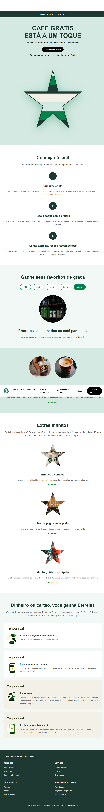

# 🌟 Starbucks Landing Page Clone

> Uma recriação moderna da **página inicial do Starbucks**, desenvolvida com foco em **design responsivo**, **animações suaves** e **boas práticas de front-end**.  
> Projeto criado para fins de estudo e portfólio.

---

## 🧩 Tecnologias utilizadas
- **HTML5** → estrutura semântica e organizada  
- **CSS3** → layout responsivo (Flexbox + Grid) e paleta fiel à marca  
- **JavaScript** → interatividade e pequenos efeitos dinâmicos  
- **Copilot IA** → auxílio na criação de imagens personalizadas  
- **Pexels & Unsplash** → imagens ilustrativas livres de direitos autorais  

---

## 🎨 Paleta de cores utilizada

| Cor | Código Hexadecimal | Uso |
|------|---------------------|-----|
| Verde escuro | `#1e3932` | Fundo e cabeçalhos |
| Verde médio | `#008248` | Destaques e botões |
| Verde claro | `#d4e9e2` | Seções suaves |
| Verde muito claro | `#f1f8f6` | Áreas de destaque |
| Bege | `#f3f1e7` | Contraste neutro |
| Preto | `#000000` | Textos e ícones |

---

## 💡 Funcionalidades e aprendizado

✅ Cabeçalho fixo (sticky header)  
✅ Seções tabeladas e bem distribuídas  
✅ Links interativos que redirecionam às páginas oficiais do Starbucks  
✅ Design totalmente responsivo (desktop e mobile)  
✅ Ícones e botões animados com hover  
✅ Estrutura sem dependências externas (projeto 100% em HTML, CSS e JS puro)  

> 💭 Durante o desenvolvimento, aprimorei:
> - Estruturação semântica de páginas web  
> - Organização de CSS em seções lógicas  
> - Criação de um layout moderno e fluido  
> - Práticas de interatividade com JavaScript  

---

## 📸 Preview

---

## 🌍 Acesse o projeto online
🔗 **[Clique aqui para ver o site](https://matheussilvestre02.github.io/starbucks-landing-page/)**

---

## 🧠 Créditos
- **Textos e layout base**: Starbucks® oficial (página inicial)  
- **Imagens**: [Pexels](https://pexels.com) e [Unsplash](https://unsplash.com)  
- **4 imagens finais (1★ por real, etc.)**: criadas com auxílio do **GitHub Copilot IA**

---

## 👨‍💻 Autor
Feito com 💚 por **Matheus Silvestre**  

  

---

### 🏷️ Tags
`#HTML` `#CSS` `#JavaScript` `#FrontEnd` `#ResponsiveDesign` `#UIClone` `#LandingPage` `#Portfolio`

---

⭐ Se gostou do projeto, deixe uma **estrela no repositório** para apoiar!
